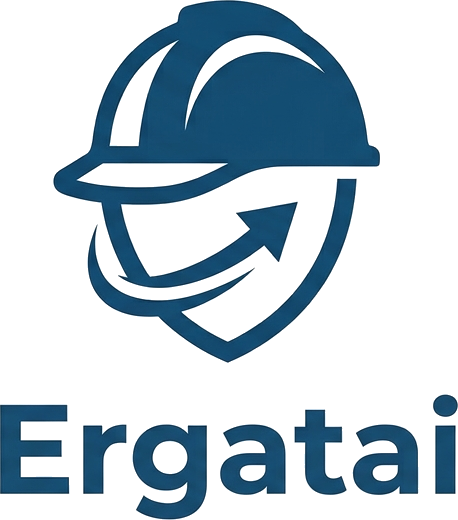

# Ergatai

<div align="center">



**Multi-Agent Collaboration Middleware**

*Tell your AI agents what to do — together.*

</div>

<div align="center">

[](LICENSE)
&ensp;
[](https://www.rust-lang.org)
&ensp;
[](CLAUDE.md)

</div>

<br/>

## What can Ergatai do?

Ergatai connects AI agents so they can work together on complex tasks — like a team of specialists coordinating on a project.

### 🔄 Agent-to-Agent Messaging

Agents send and receive messages through Ergatai's relay. Claude Code can ask Cursor to refactor a module, and Codex can report results back.

### 📋 DAG-Based Task Orchestration

Submit multi-step workflows where different agents handle different phases — with dependencies between tasks.

### 🔒 Safe Concurrent File Access

When multiple agents edit the same codebase, Ergatai prevents conflicts with token-based locking and kernel-level enforcement.

<br/>

## Quick Start

### 1. Install

```bash
curl -sSL https://raw.githubusercontent.com/windreach/Ergatai/main/install.sh | bash
```

This installs:
- `ergatai` — CLI tool
- `ega` — short alias (symlink)
- `ergatai-server` — API server (with `CAP_SYS_ADMIN` for file locking)

### 2. Start the server

```bash
ergatai-server --port 3000
```

### 3. Quick launch an agent

```bash
# In your project directory
ega claude
```

This creates a workspace, spawns the agent, and attaches to the terminal session — all in one command.

### 4. Configure MCP for other agents

Add Ergatai to your agent's MCP config:

```json
{
  "mcpServers": {
    "ergatai": {
      "url": "http://localhost:3000/mcp/alice"
    }
  }
}
```

Each agent needs a unique path suffix (`/mcp/alice`, `/mcp/bob`, etc.).

📖 See [Installation Guide](docs/getting-started/INSTALL.md) and [CLI Guide](docs/guide/CLI.md) for details.

<br/>

## Features

| Capability | Description |
|------------|-------------|
| **Agent Messaging** | Agents send and receive messages through Ergatai's relay |
| **DAG Orchestration** | Submit markdown-formatted workflows with task dependencies |
| **Safe Concurrency** | Token-based READ/WRITE/ADMIN locks with kernel enforcement |
| **Agent Discovery** | Automatic registration when agents connect via MCP |
| **Agent Agnostic** | Works with any MCP-compatible agent — Claude, Cursor, Codex, and more |
| **Local First** | All execution runs locally; no data leaves your machine |
| **Crash Recovery** | Heartbeat monitoring reclaims stale locks automatically |

<br/>

## Architecture

```
Agents (Claude, Cursor, Codex, ...)
         │ MCP
         ▼
┌────────────────────────────────┐
│     Ergatai Middleware         │
│  ┌──────────────────────────┐  │
│  │   MCP Server + rmux      │  │
│  └──────────────────────────┘  │
│  ┌──────────────────────────┐  │
│  │  Agent Registry │ DAG    │  │
│  │  File Locks     │ Sched  │  │
│  └──────────────────────────┘  │
│  ┌──────────────────────────┐  │
│  │   NATS + JetStream       │  │
│  └──────────────────────────┘  │
└────────────────────────────────┘
         │
         ▼
   Shared Codebase (with file locking)
```

📖 See [Architecture Overview](docs/architecture/OVERVIEW.md) for details.

<br/>

## Supported Agents

| Agent | Status | Notes |
|-------|--------|-------|
| Claude Code | ✅ Verified | Native MCP support |
| Cursor | ✅ Verified | IDE-integrated agent |
| Codex | ✅ Supported | OpenAI CLI agent |
| Goose | ✅ Supported | Block's AI assistant |
| Cline | ✅ Supported | VS Code extension |
| Custom | ✅ Supported | Any MCP-compatible runtime |

<br/>

## Documentation

- [Installation Guide](docs/getting-started/INSTALL.md) — detailed installation steps
- [CLI Guide](docs/guide/CLI.md) — command reference
- [MCP Configuration](docs/guide/MCP.md) — agent MCP setup
- [Architecture](docs/architecture/OVERVIEW.md) — system design for developers

<br/>

## FAQ

<details>
<summary><b>Should I use Ergatai or wire agents directly?</b></summary>

Use Ergatai when you have 2+ agents that need to coordinate. Use direct wiring only for simple point-to-point communication.
</details>

<details>
<summary><b>Does Ergatai send data to the cloud?</b></summary>

No. Ergatai runs entirely locally. No telemetry, no phoning home.
</details>

<details>
<summary><b>Why does file locking require CAP_SYS_ADMIN?</b></summary>

Ergatai uses Linux fanotify for kernel-level file locking. This requires `CAP_SYS_ADMIN` — a kernel limitation. Without it, Ergatai falls back to advisory mode.
</details>

<br/>

## License

Apache License 2.0 — see [LICENSE](LICENSE) for details.

<br/>

<div align="center">

**Tell your AI agents what to do, and they get it done — together.**

</div>
