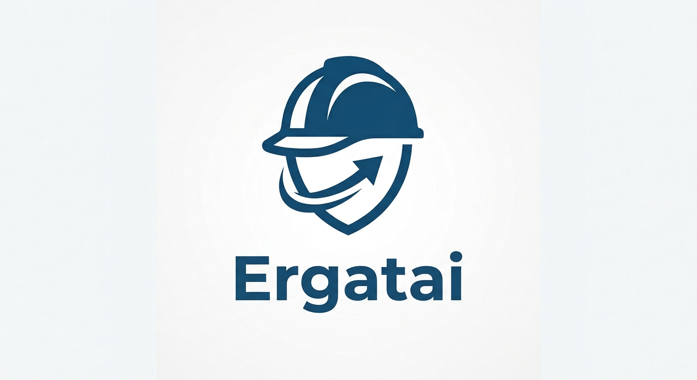

# Ergatai

<div align="center">



**Multi-Agent Collaboration Middleware**

*Tell your AI agents what to do — together.*

</div>

<div align="center">

[](LICENSE)
&ensp;
[](https://www.rust-lang.org)
&ensp;
[](CLAUDE.md)
&ensp;
[](#contributing)

</div>

<br/>

# What can Ergatai do?

Ergatai connects AI agents so they can work together on complex tasks — like a team of specialists coordinating on a project. You describe what needs to be done, and Ergatai routes the work across agents.

### 🔄 Agent-to-Agent Messaging

Agents send and receive messages through Ergatai's relay. Claude Code can ask Cursor to refactor a module, and Codex can report results back.

```
User: "Claude, ask Cursor to write unit tests for src/auth.rs"
Claude: [calls send_message → target: cursor]
Cursor: [runs tests, reports back]
Claude: "Tests written. All 12 passing."
```

### 📋 DAG-Based Task Orchestration

Submit multi-step workflows where different agents handle different phases — with dependencies between tasks.

```markdown
## Task A — Code Analysis
- agent: claude-code
- task: Review all changes in PR #42 and identify risky modules

## Task B — Test Writing
- agent: cursor
- task: Write unit tests for modules identified in Task A
- depends_on: [Task A]

## Task C — Security Review
- agent: codex
- task: Run security audit on changed files
- depends_on: [Task A]
```

###  Safe Concurrent File Access

When multiple agents edit the same codebase, Ergatai prevents conflicts with token-based locking, automatic git snapshots, and heartbeat monitoring.

<br/>

# Quickstart

**1. Build and start the server:**

```bash
cargo build --release -p ergatai-api
./target/release/ergatai-api --port 3000
```

**2. Add Ergatai to your agent's MCP config:**

```json
{
  "mcpServers": {
    "ergatai": {
      "url": "http://localhost:3000/mcp"
    }
  }
}
```

**3. Start collaborating** — agents auto-register on connect and can immediately call `list_agents`, `send_message`, `submit_orchestration`, and `check_dag_status`.

📖 See [MCP Configuration Guide](docs/MCP_CONFIG_GUIDE.md) and [ACP SDK Guide](docs/ACP_SDK_GUIDE.md) for full details.

<br/>

# Architecture

```
┌──────────────┐              ┌──────────────┐              ┌──────────────┐
│   Agent A    │ ─── MCP ──→ │              │ ←─── MCP ─── │   Agent B    │
│  (Claude)    │              │   Ergatai    │              │   (Cursor)   │
│              │ ←─ ACP ─────│  MCP Server  │ ─────ACP ───→│              │
└──────────────┘              ──────┬───────┘              ──────────────┘
                                     │
                              ┌──────┴──────┐
                              │   NATS      │
                              │  JetStream  │
                              └──────┬──────┘
                                     │
                              ┌──────┴──────┐
                              │   Agent C   │
                              │   (Codex)   │
                              └─────────────┘
```

### Protocol Stack

| Layer | Protocol | Direction | Purpose |
|-------|----------|-----------|---------|
| **Agent → Ergatai** | MCP (Streamable HTTP) | Inbound | Agents connect as MCP clients; call tools (send_message, list_agents, etc.) |
| **Ergatai → Agent** | MCP Custom Notification | Outbound | Ergatai pushes `ergatai/message` notifications over the existing MCP connection |
| **Internal** | NATS + JetStream | Event bus | Task routing, completion events, file change notifications |

**Key point**: Agents never communicate directly. All inter-agent messaging is relayed through Ergatai via MCP notifications — no HTTP server needed on the agent side.

### How It Works

1. **Agent Registration** — When an agent connects via MCP, it is automatically discovered and registered
2. **Message Relay** — Agent A calls `send_message` via MCP; Ergatai pushes an `ergatai/message` notification to Agent B over its existing MCP connection
3. **Orchestration** — Submit a DAG definition; Ergatai parses dependencies and schedules tasks across agents
4. **Conflict Prevention** — Token-based file locks ensure concurrent edits never corrupt the codebase

<br/>

# Features

| Capability | Description |
|------------|-------------|
| **Agent-to-Agent Messaging** | Agents send and receive messages through Ergatai's relay |
| **DAG Orchestration** | Submit markdown-formatted workflows with task dependencies |
| **Safe Concurrency** | Token-based READ/WRITE/ADMIN locks with automatic reclamation |
| **Agent Discovery** | Automatic registration when agents connect via MCP |
| **Agent Agnostic** | Works with any MCP-compatible agent — Claude, Cursor, Codex, and more |
| **Local First** | All execution runs locally; no data leaves your machine |
| **Crash Recovery** | Heartbeat monitoring reclaims stale locks automatically |
| **TLS Support** | Optional HTTPS with rustls for secure deployments |
| **Rate Limiting** | Per-agent rate limits prevent spam and runaway loops |
| **Prometheus Metrics** | `/metrics` endpoint for observability |

<br/>

# MCP Tools

Ergatai exposes four tools to connected agents:

### `list_agents`

List all connected agents and their current status.

**Input:**
```json
{ "include_capabilities": true }
```

**Response:**
```json
{
  "agents": [
    {
      "agent_id": "claude-code",
      "status": "active",
      "capabilities": ["chat", "code", "tools"],
      "connected_at": "2026-08-14T10:00:00Z",
      "last_heartbeat": "2026-08-14T10:05:00Z"
    }
  ],
  "total": 1
}
```

### `send_message`

Send a message to another registered agent.

**Input:**
```json
{
  "target_agent_id": "cursor",
  "message": "Please refactor src/auth.rs to use the new middleware pattern",
  "message_type": "request"
}
```

**Response:**
```json
{
  "message_id": "msg-a1b2c3",
  "status": "delivered",
  "delivery_method": "mcp_notification",
  "target_agent_id": "cursor",
  "message_type": "request"
}
```

### `submit_orchestration`

Submit a DAG workflow for multi-agent parallel execution.

**Input:**
```json
{
  "dag_definition": "## Task A\n- agent: claude-code\n- task: Analyze codebase structure\n\n## Task B\n- agent: cursor\n- task: Write unit tests\n- depends_on: [Task A]",
  "context": {
    "project": "my-app",
    "branch": "main"
  }
}
```

### `check_dag_status`

Check the execution progress of a submitted DAG.

**Input:**
```json
{ "dag_id": "dag-abc123" }
```

<br/>

# Supported Agents

Ergatai works with any agent that implements the MCP protocol:

| Agent | Status | Notes |
|-------|--------|-------|
| Claude Code | ✅ Verified | Native MCP support |
| Cursor | ✅ Verified | IDE-integrated agent |
| Codex | ✅ Supported | OpenAI CLI agent |
| Goose | ✅ Supported | Block's AI assistant |
| Cline | ✅ Supported | VS Code extension |
| Aider | ✅ Supported | Terminal coding agent |
| Custom Agents | ✅ Supported | Any MCP-compatible runtime |

<br/>

# Project Structure

```
ergatai/
├── crates/
│   ├── ergatai-core/      # Core library — business logic facade
│   ├── ergatai-api/       # MCP server + REST API (main entry point)
│   ├── ergatai-acp/       # ACP protocol layer
│   ├── ergatai-collab/    # Multi-agent collaboration primitives
│   ├── ergatai-dag/       # DAG parser, scheduler, dependency resolution
│   ├── ergatai-nats/      # Embedded NATS server + JetStream streams
│   ├── ergatai-lock/      # Token-based file access control
│   ├── ergatai-agent/     # Agent config, discovery, hosted agents
│   └── ergatai-error/     # Shared error types
├── docs/
│   └── MCP_CONFIG_GUIDE.md, ACP_SDK_GUIDE.md, ...
├── examples/
│   └── simple-agent/      # Minimal MCP agent example
├── Cargo.toml
└── README.md
```

<br/>

# Development

### Build

```bash
cargo build --workspace
cargo build --release --workspace
cargo build -p ergatai-api          # single crate
```

### Run

```bash
cargo run -p ergatai-api -- --port 3000
RUST_LOG=debug cargo run -p ergatai-api -- --port 3000
ERGATAI_API_TOKEN=secret cargo run -p ergatai-api -- --port 3000
```

### Tests & Lint

```bash
cargo test --workspace
cargo clippy --workspace -- -D warnings
cargo fmt --all
```

<br/>

# Tech Stack

| Component | Technology | Version |
|-----------|-----------|---------|
| Language | Rust | 2021 edition |
| MCP Protocol | Streamable HTTP | 2025-11-25 |
| Messaging | async-nats + JetStream | 0.38 |
| Database | rusqlite (embedded SQLite) | 0.31 |
| HTTP Server | axum | 0.7 |
| TLS | rustls (via axum-server) | — |
| Async Runtime | tokio | 1.36 |
| Serialization | serde + serde_json | 1.0 |
| CLI | clap | 4.5 |
| Observability | Prometheus (metrics crate) | — |

<br/>

# File Access Control

When multiple agents collaborate on the same repository, Ergatai ensures safe concurrent writes:

- **Token-based locking** — READ / WRITE / ADMIN modes with explicit acquire/release
- **Heartbeat monitoring** — Stale locks reclaimed after 90s of inactivity
- **Git snapshots** — Automatic pre-write snapshots enable rollback on conflict
- **Conflict arbitration** — Priority-based resolution when two agents contend for the same file
- **Audit logging** — Every lock acquire, release, and conflict is logged

<br/>

# FAQ

<details>
<summary><b>Should I use Ergatai or wire agents directly?</b></summary>

Use Ergatai when you have 2+ agents that need to coordinate — it removes the need for each agent to know about every other agent. Use direct wiring only for simple point-to-point communication.
</details>

<details>
<summary><b>Can I use this with my own custom agent?</b></summary>

Yes. As long as your agent implements the MCP protocol (can connect as an MCP client), Ergatai will discover it automatically and enable messaging. See `examples/simple-agent/` for a complete working implementation.
</details>

<details>
<summary><b>Does Ergatai send data to the cloud?</b></summary>

No. Ergatai runs entirely locally. NATS, the MCP server, and all message forwarding happen on your machine. No telemetry, no phoning home.
</details>

<details>
<summary><b>How does Ergatai handle agent crashes?</b></summary>

The agent reaper checks heartbeats every 30s. If an agent goes silent for 90s, it is marked disconnected and its locks are released. Pending messages to that agent are queued until it reconnects.
</details>

<details>
<summary><b>What's the difference between the API server and the core library?</b></summary>

`ergatai-api` is the standalone MCP server (the entry point you run). `ergatai-core` is the reusable library — if you want to embed Ergatai's collaboration logic inside another application, depend on `ergatai-core`.
</details>

<br/>

# Roadmap

### v0.x — Current Focus

- [x] MCP server with Streamable HTTP transport
- [x] Agent auto-registration on connect
- [x] Message relay via MCP custom notifications
- [x] Agent discovery and heartbeat
- [x] DAG orchestration engine
- [x] Token-based file locking
- [x] Prometheus metrics
- [x] TLS support
- [ ] End-to-end integration tests
- [ ] CLI chat interface with TUI progress display
- [ ] Stable core features for production use

### Near-term

- [ ] Enhanced error reporting across agent boundaries
- [ ] Persistent message queue (retry on reconnect)
- [ ] Plugin system for custom tool handlers
- [ ] Multi-workspace support

### v1.0.0 — Planned

- [ ] Desktop GUI application (Tauri/Electron)
- [ ] Visual DAG editor
- [ ] Real-time agent collaboration monitoring
- [ ] User management and permission system
- [ ] Enterprise features (SAML, audit export)

<br/>

# Security

Security audit completed 2026-08-14:

- ✅ API path traversal protection
- ✅ Bearer token authentication (`--api-token`)
- ✅ Sensitive file detection enhanced
- ✅ Configuration file permission hardening (`0o600`)
- ✅ Install command whitelist (shell injection prevention)
- ✅ NATS zombie process cleanup
- ✅ Signal handler for graceful shutdown
- ✅ Lock manager correctness fixes
- ✅ Rate limiting per agent (1 req/s, burst 20)

<br/>

# Contributing

Contributions are welcome! Please read [CONTRIBUTING.md](CONTRIBUTING.md) before submitting a pull request.

<br/>

# License

This project is licensed under the Apache License 2.0 — see [LICENSE](LICENSE) for details.

<br/>

<div align="center">

**Tell your AI agents what to do, and they get it done — together.**

</div>

<div align="center"> Made with ❤️ by the Ergatai team </div>
